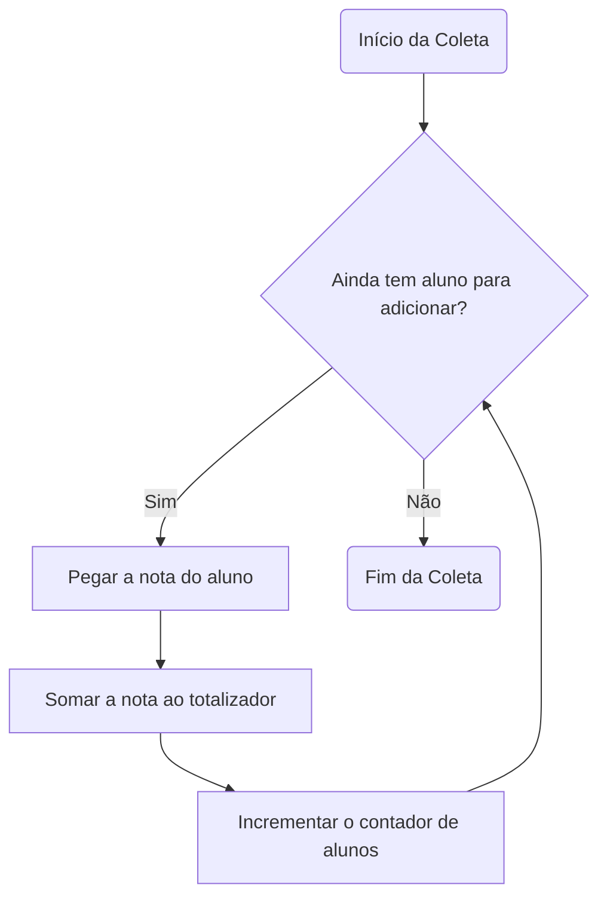
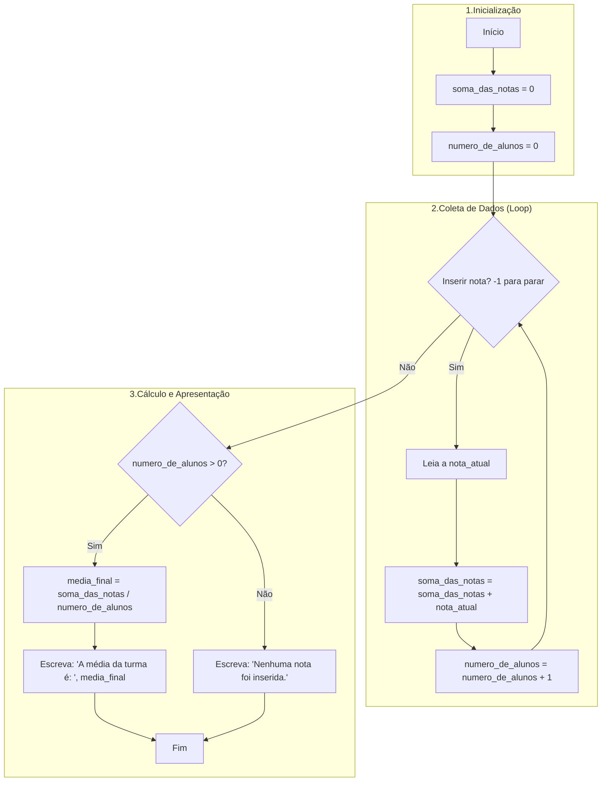

# Exemplo Prático: Calculando a Média da Turma

Este exemplo mostrará como o Raciocínio Computacional nos ajuda a planejar a solução de forma estruturada, onde a escrita do código (o algoritmo em Portugol) é a etapa final e natural do processo, e não o ponto de partida.

Nosso desafio é criar um método para calcular a nota média de uma turma de alunos. Não sabemos quantos alunos a turma tem. Vamos aplicar os quatro pilares do Raciocínio Computacional para construir nossa solução passo a passo.

## 1. Decomposição(Quebrando o Problema)

Primeiro, vamos quebrar o grande problema "calcular a média" em partes menores e mais gerenciáveis:

- Tarefa 1: Precisamos de um jeito de obter a nota de cada um dos alunos.

- Tarefa 2: Precisamos somar todas as notas que foram obtidas.

- Tarefa 3: Precisamos contar quantos alunos (e, portanto, quantas notas) temos na turma.

- Tarefa 4: Ao final, precisamos dividir a soma total das notas pelo número total de alunos para encontrar a média.

- Tarefa 5: Por último, precisamos mostrar o resultado final.

Ao decompor, transformamos um problema complexo em uma lista de tarefas simples e claras.

## 2. Reconhecimento de Padrões (Identificando Repetições)

Agora, vamos analisar as tarefas que decompomos. Existe alguma coisa que se repete? Sim!

As tarefas "obter a nota de um aluno", "somar essa nota ao total" e "contar mais um aluno" se repetem para todos os alunos da turma. Este é um padrão de repetição, um ciclo (ou loop).

Podemos visualizar este padrão com um fluxograma simples:



Reconhecer este padrão é crucial, pois nos diz que não precisamos escrever um código separado para o Aluno 1, Aluno 2, Aluno 3, etc. Podemos criar uma estrutura que repete o mesmo bloco de código quantas vezes for necessário.

## 3. Abstração (Focando no Essencial)

Neste ponto, vamos filtrar os detalhes e focar apenas no que é essencial para resolver o nosso problema.

Detalhes que podemos ignorar (irrelevantes):

- O nome de cada aluno (João, Maria, Carlos...).
- A matéria da prova (Matemática, História...).
- A data em que a prova foi aplicada.

Informações que devemos manter (essenciais):

- Onde vamos guardar a soma de todas as notas? Vamos chamar de `soma_das_notas`.

- Onde vamos guardar a contagem de alunos? Vamos chamar de `numero_de_alunos`.

- Onde vamos guardar a nota de cada aluno enquanto a processamos? Vamos chamar de `nota_atual`.

- Onde vamos guardar o resultado final? Vamos chamar de `media_final`.

A abstração nos ajudou a definir as variáveis que nosso algoritmo precisará para funcionar. Estamos criando um modelo simplificado da realidade.

## 4. Algoritmo (Criando a Sequência de Passos)

Agora, e somente agora, com o problema decomposto, os padrões reconhecidos e as informações essenciais definidas, estamos prontos para montar a receita final: o nosso algoritmo.

Primeiro, vamos montar o fluxograma completo da nossa lógica, unindo todas as partes.

**Fluxograma do Algoritmo Completo**



**Código em Portugol**

O fluxograma acima pode ser traduzido diretamente para Portugol. Note como cada parte do fluxograma corresponde a uma parte do código. A escrita do código se torna uma tarefa de "tradução", e não de "criação do zero".

```portugol
algoritmo "CalculadoraDeMediaDaTurma"
// Este algoritmo calcula a média de notas de uma turma.
// O usuário insere as notas uma a uma e digita -1 para finalizar.

var
   // Variáveis definidas na etapa de Abstração
   soma_das_notas: real
   numero_de_alunos: inteiro
   nota_atual: real
   media_final: real

inicio
   // --- Etapa 1: Inicialização ---
   soma_das_notas <- 0
   numero_de_alunos <- 0
   escreva("--- Calculadora de Média da Turma ---")
   escrevaL("") // Pula uma linha
   escrevaL("Instrução: Insira a nota de cada aluno. Digite -1 quando terminar.")
   escrevaL("---------------------------------------------------------------")

   // --- Etapa 2: Coleta de Dados (Padrão de Repetição / Loop) ---
   escreva("Digite a nota do 1º aluno (ou -1 para sair): ")
   leia(nota_atual)

   enquanto (nota_atual <> -1) faca
      // Soma a nota e incrementa o contador
      soma_das_notas <- soma_das_notas + nota_atual
      numero_de_alunos <- numero_de_alunos + 1

      // Pede a próxima nota
      escreva("Digite a nota do ", numero_de_alunos + 1, "º aluno (ou -1 para sair): ")
      leia(nota_atual)
   fimEnquanto

   escrevaL("")
   escrevaL("---------------------------------------------------------------")

   // --- Etapa 3: Cálculo e Apresentação do Resultado ---
   // Verifica se pelo menos uma nota foi inserida para evitar divisão por zero
   se (numero_de_alunos > 0) entao
      media_final <- soma_das_notas / numero_de_alunos
      escreva("Foram inseridas ", numero_de_alunos, " notas.")
      escrevaL("A soma total das notas é: ", soma_das_notas)
      escrevaL("A média final da turma é: ", media_final)
   senao
      escrevaL("Nenhuma nota foi inserida. Não é possível calcular a média.")
   fimSe

   escrevaL("---------------------------------------------------------------")


fimalgoritmo
```

## Conclusão do Exemplo

Este exercício demonstra claramente o poder do Raciocínio Computacional. Ao invés de pular direto para o código e se perder em detalhes, nós:

1. Decompomos o problema em partes menores.

2. Identificamos um padrão de repetição que simplificou a lógica.

3. Abstraímos os detalhes para focar nas variáveis essenciais.

4. Construímos o algoritmo (fluxograma e código) como a etapa final, de forma lógica e estruturada, quase como montar um quebra-cabeça cujas peças já havíamos preparado.
