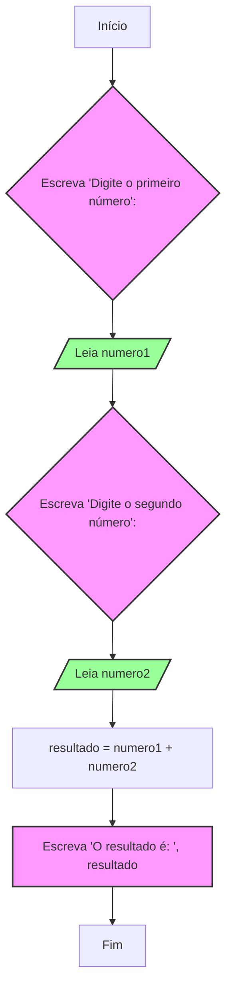

# Módulo 1: Fundamentos da Lógica de Programação

Bem-vindo(a) ao início da nossa jornada! Neste primeiro módulo, vamos solidificar os conceitos que transformam uma ideia em um programa de computador funcional. O objetivo aqui é entender o "o quê" e o "porquê" por trás da programação, antes mesmo de nos aprofundarmos no "como".

## 1. Revisão: O Poder do Raciocínio Computacional

Como vimos na nossa introdução e no exemplo prático do cálculo da média, o Raciocínio Computacional é a nossa principal ferramenta de planejamento. Antes de escrever uma única linha de código, nós pensamos sobre o problema de forma estruturada. Vamos recapitular rapidamente os quatro pilares:

1.  **Decomposição**: Quebrar um problema grande em tarefas menores e mais fáceis de resolver.
2.  **Reconhecimento de Padrões**: Encontrar repetições ou similaridades que possam ser otimizadas.
3.  **Abstração**: Focar nos detalhes essenciais e ignorar o que é irrelevante para a solução.
4.  **Algoritmo**: Criar uma sequência de passos lógicos e ordenados para executar a solução.

Lembre-se de como usamos isso para calcular a média da turma: decompomos o problema (pegar nota, somar, contar), reconhecemos o padrão de repetição (o loop `enquanto`), abstraímos as informações (criando as variáveis `soma_das_notas`, `numero_de_alunos`) e, por fim, montamos o algoritmo completo. Este processo de pensamento será nossa bússola em todos os desafios futuros.

## 2. Definição de Algoritmo: A Receita do Sucesso

### Motivação

Imagine que você quer ensinar um amigo a fazer um bolo, mas esse amigo nunca cozinhou na vida e seguirá suas instruções _exatamente_ como foram dadas, sem improvisar. Você precisaria criar uma lista de passos muito clara, em uma ordem específica, que não deixe margem para dúvidas. Essa lista de passos é, em sua essência, um **algoritmo**.

Um algoritmo é uma **sequência finita e ordenada de passos, clara e sem ambiguidades, que leva à resolução de um problema ou à execução de uma tarefa.** O computador é como nosso amigo cozinheiro: ele só faz exatamente o que mandamos.

### Características Essenciais de um Bom Algoritmo

- **Finitude**: Todo algoritmo deve ter um fim. Ele não pode executar para sempre. Uma receita de bolo tem um último passo ("servir"), e nossos programas também precisam de um ponto final.
- **Legibilidade**: Os passos devem ser claros e fáceis de entender, tanto para quem escreve quanto para quem lê (outros programadores ou você mesmo no futuro). Um código confuso é a receita para o desastre.
- **Eficiência**: Um algoritmo deve resolver o problema usando a menor quantidade de recursos (tempo de processamento, memória do computador) possível. Entre duas receitas que produzem o mesmo bolo, a mais rápida e que usa menos ingredientes é a mais eficiente.

## 3. Formas de Representar um Algoritmo

Podemos descrever a mesma lógica de diferentes maneiras. Cada forma de representação tem sua utilidade, dependendo do estágio do projeto e do público. Vamos usar um problema muito simples para ilustrar as três formas principais: **"Somar dois números fornecidos pelo usuário"**.

### 3.1. Descrição Narrativa

É a forma mais simples e humana de descrever os passos, usando linguagem cotidiana.

**Algoritmo para somar dois números:**

1.  Peça para o usuário digitar o primeiro número.
2.  Guarde esse número em um local temporário.
3.  Peça para o usuário digitar o segundo número.
4.  Guarde esse segundo número em outro local temporário.
5.  Some os dois números guardados.
6.  Mostre o resultado da soma para o usuário.

### 3.2. Fluxograma (Diagrama de Blocos)

O fluxograma usa símbolos gráficos para representar a sequência de ações e decisões, oferecendo uma visualização clara do fluxo lógico. É a nossa ferramenta visual favorita para planejar.

**Fluxograma para somar dois números:**



- **Símbolos usados**:
  - `Oval`: Início ou Fim do algoritmo.
  - `Paralelogramo`: Entrada (Leia) ou Saída (Escreva) de dados.
  - `Retângulo`: Processamento ou cálculo.

### 3.3. Pseudocódigo (Portugol)

O pseudocódigo é a ponte entre o fluxograma e a linguagem de programação real. Ele usa uma sintaxe estruturada e palavras-chave que se assemelham à programação, mas ainda em português, para focar na lógica.

**Portugol para somar dois números:**

```portugol
algoritmo "SomaDeDoisNumeros"
// Este é o cabeçalho do nosso programa.
// Damos um nome para identificar o que ele faz.

// A seção 'var' é onde declaramos nossas "caixas" (variáveis).
// É aqui que aplicamos a Abstração, definindo o que é essencial.
var
   numero1: real  // Caixa para guardar o primeiro número. 'real' permite casas decimais.
   numero2: real  // Caixa para guardar o segundo número.
   resultado: real // Caixa para guardar a soma.

// A seção 'inicio' marca onde a execução dos passos começa.
inicio
   // Passo 1 e 2: Pedir e ler o primeiro número (Corresponde aos blocos B e C do fluxograma)
   escreva("Digite o primeiro número: ")
   leia(numero1)

   // Passo 3 e 4: Pedir e ler o segundo número (Corresponde aos blocos D e E do fluxograma)
   escreva("Digite o segundo número: ")
   leia(numero2)

   // Passo 5: Realizar o cálculo e guardar (Corresponde ao bloco F do fluxograma)
   resultado <- numero1 + numero2 // O símbolo '<-' significa 'recebe' ou 'armazena em'.

   // Passo 6: Mostrar o resultado final (Corresponde ao bloco G do fluxograma)
   escreva("O resultado da soma é: ", resultado)

// 'fimalgoritmo' indica o fim da nossa sequência de passos.
fimalgoritmo
```

## 4. Ambiente de Desenvolvimento: Apresentação do VisualG

Para praticar e ver nossos algoritmos em ação, usaremos uma ferramenta chamada **VisualG**. Ela é um interpretador de Portugol projetado especificamente para estudantes.

### Por que usar o VisualG?

- **Foco na Lógica**: Ele nos permite escrever e testar a lógica dos nossos algoritmos sem nos preocuparmos com as complexidades de uma linguagem de programação profissional.
- **Sintaxe em Português**: Facilita a transição da descrição narrativa para o código.
- **Visualização de Variáveis**: Permite acompanhar em tempo real o que está acontecendo dentro das nossas "caixas" (variáveis).
- **Mensagens de Erro Claras**: Ajuda a identificar e corrigir erros de lógica ou de escrita.

### Primeiros Passos no VisualG

1.  **Instalação**: Baixe e extraia o VisualG em uma pasta no seu computador. Não precisa de instalação complexa, basta executar o arquivo `VisualG30.exe`.
2.  **Interface**: Ao abrir, você verá uma tela dividida. À esquerda, fica o editor de código, onde você digitará seu algoritmo. À direita, fica a área onde os resultados (o que você manda o programa `escrever`) aparecerão.
3.  **Seu Primeiro Código**: Copie e cole o algoritmo `SomaDeDoisNumeros` que fizemos acima no editor do VisualG.
4.  **Execução**: Para rodar o algoritmo, pressione a tecla **F9** (ou vá no menu `Algoritmo` > `Executar`).
5.  **Interação**: O programa irá parar e esperar que você digite os números no console à direita. Após digitar cada número, pressione Enter. No final, ele exibirá o resultado.

Experimente! Ver seu primeiro algoritmo funcionando é um passo muito gratificante.

## Exercícios Práticos

Agora é sua vez de aplicar o que aprendeu! Para cada problema abaixo, crie as três representações: **Descrição Narrativa**, **Fluxograma (em Mermaid)** e o **código em Portugol** para ser testado no VisualG.

1.  **Calculadora de Área**: Crie um algoritmo que peça ao usuário a base e a altura de um retângulo, calcule sua área (`area = base * altura`) e mostre o resultado.
2.  **Antecessor e Sucessor**: Crie um algoritmo que leia um número inteiro e mostre na tela o seu antecessor e o seu sucessor. (Ex: se o usuário digitar 10, o programa deve mostrar "Antecessor: 9, Sucessor: 11").

## Aplicações Reais

Esses conceitos fundamentais de entrada, processamento e saída são a base de quase tudo no mundo digital:

- **Caixas eletrônicos**: Pedem sua senha (entrada), validam (processamento), perguntam o valor (entrada), processam o saque (processamento) e liberam o dinheiro (saída).
- **Formulários de contato em sites**: Pedem seus dados (entrada), validam e enviam um e-mail (processamento) e mostram uma mensagem de sucesso (saída).
- **Calculadoras**: A aplicação mais direta do nosso exemplo de soma.
