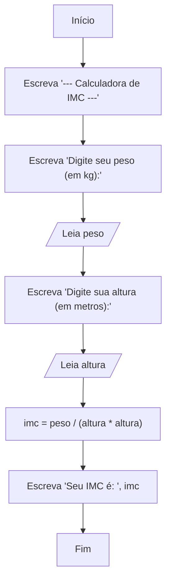

# Módulo 2: Elementos Essenciais de um Algoritmo

Com o plano do nosso algoritmo em mãos (seja na forma de descrição narrativa ou de um fluxograma), precisamos agora dos elementos para construí-lo de fato. Este módulo apresenta os blocos de construção fundamentais de qualquer programa: variáveis, tipos de dados e os operadores que nos permitem manipular esses dados.

## 1. Conceito de Variáveis e Constantes

### Motivação

Imagine que você está cozinhando e precisa medir os ingredientes. Você não joga a farinha e o açúcar direto na mesa; você usa potes, xícaras e colheres para guardá-los e manipulá-los. Em um algoritmo, **variáveis** e **constantes** são nossos "potes": são espaços na memória do computador onde guardamos informações para usar depois.

Esta é a **Abstração** em sua forma mais pura: damos um nome significativo a um espaço de memória para não precisarmos nos preocupar com seu endereço físico.

### Variáveis

Uma **variável** é um espaço de memória cujo conteúdo pode **mudar** durante a execução do algoritmo. É como um quadro branco onde você pode escrever, apagar e escrever outra coisa.

Para usar uma variável, precisamos seguir dois passos:

1.  **Declaração**: É o ato de criar a "caixa" e dar um nome a ela, especificando o tipo de coisa que ela vai guardar.
2.  **Atribuição**: É o ato de colocar um valor dentro da "caixa".

```portugol
// Declaração: Criamos as caixas e as rotulamos.
var
   idade_aluno: inteiro // Uma caixa chamada 'idade_aluno' que só guardará números inteiros.
   nome_aluno: caractere // Uma caixa chamada 'nome_aluno' que guardará texto.

inicio
   // Atribuição: Colocamos valores dentro das caixas.
   // O símbolo '<-' lê-se "recebe".
   idade_aluno <- 25
   nome_aluno <- "Maria Silva"

   // O valor pode ser alterado a qualquer momento.
   idade_aluno <- 26 // Agora, a mesma caixa 'idade_aluno' contém o valor 26.
```

**Regras para Nomes (Identificadores):**

- Devem começar com uma letra.
- Não podem ter espaços em branco (use o underline, como `nome_aluno`).
- Não podem usar caracteres especiais (exceto underline).
- Não podem ter acentos.
- Não podem ser iguais a palavras reservadas do Portugol (`var`, `inicio`, `se`, `leia`, etc.).

### Constantes

Uma **constante** é um espaço de memória cujo valor, uma vez definido, **não pode ser alterado**. É como gravar um nome em uma placa de pedra.

**Motivação:** Usamos constantes para valores fixos que se repetem no código, tornando-o mais legível e fácil de manter. Por exemplo, o valor de PI (3.14159) nunca muda.

_Nota: O VisualG não possui um comando explícito para constantes, mas em programação, o conceito é fundamental. Simulamos uma constante declarando uma variável e, por convenção, nunca alterando seu valor inicial._

## 2. Tipos de Dados Primitivos

O tipo de dado define a natureza da informação que uma variável pode armazenar. Isso diz ao computador quanto espaço alocar e que tipo de operações são permitidas.

- `INTEIRO`: Para números inteiros, positivos ou negativos, sem casas decimais.
  - **Exemplos**: idade de uma pessoa (25), quantidade de produtos (100), ano de nascimento (1990).
- `REAL`: Para números que podem ter casas decimais.
  - **Exemplos**: preço de um produto (19.99), altura de uma pessoa (1.75), média de notas (8.5).
- `CARACTERE`: Para texto. Pode ser uma única letra, uma palavra ou uma frase inteira. O valor é sempre colocado entre aspas duplas (`"`).
  - **Exemplos**: nome de uma pessoa ("João da Silva"), endereço ("Rua das Flores, 123"), resposta de um usuário ("sim").
- `LOGICO`: Armazena apenas um de dois valores possíveis: `VERDADEIRO` ou `FALSO`. É a base para a tomada de decisões em algoritmos.
  - **Exemplos**: usuario_logado (`VERDADEIRO`), pagamento_aprovado (`FALSO`), eh_maior_de_idade (`VERDADEIRO`).

## 3. Operadores: As Ferramentas de Processamento

Se as variáveis são nossos ingredientes, os operadores são as ações que podemos realizar com eles (misturar, cortar, comparar).

### 3.1. Operadores Aritméticos

Usados para realizar cálculos matemáticos.

| Operador | Descrição                 | Exemplo    | Resultado |
| :------- | :------------------------ | :--------- | :-------- |
| `+`      | Adição                    | `5 + 3`    | `8`       |
| `-`      | Subtração                 | `5 - 3`    | `2`       |
| `*`      | Multiplicação             | `5 * 3`    | `15`      |
| `/`      | Divisão                   | `10 / 2`   | `5.0`     |
| `^`      | Potenciação               | `2 ^ 3`    | `8`       |
| `mod`    | Módulo (Resto da Divisão) | `10 mod 3` | `1`       |

### 3.2. Operadores Relacionais

Usados para comparar dois valores. O resultado de uma comparação é **sempre** um valor `LOGICO` (`VERDADEIRO` ou `FALSO`).

| Operador | Descrição        | Exemplo   | Resultado    |
| :------- | :--------------- | :-------- | :----------- |
| `>`      | Maior que        | `10 > 5`  | `VERDADEIRO` |
| `<`      | Menor que        | `10 < 5`  | `FALSO`      |
| `>=`     | Maior ou igual a | `5 >= 5`  | `VERDADEIRO` |
| `<=`     | Menor ou igual a | `10 <= 5` | `FALSO`      |
| `=`      | Igual a          | `5 = 5`   | `VERDADEIRO` |
| `<>`     | Diferente de     | `10 <> 5` | `VERDADEIRO` |

### 3.3. Operadores Lógicos

Usados para combinar duas ou mais expressões lógicas.

| Operador      | Descrição                                                                 | Exemplo                         | Resultado    |
| :------------ | :------------------------------------------------------------------------ | :------------------------------ | :----------- |
| `E` (`AND`)   | Retorna `VERDADEIRO` somente se **ambas** as condições forem verdadeiras. | `(5 > 3) E (10 = 10)` (V e V)   | `VERDADEIRO` |
| `OU` (`OR`)   | Retorna `VERDADEIRO` se **pelo menos uma** das condições for verdadeira.  | `(5 < 3) OU (10 = 10)` (F ou V) | `VERDADEIRO` |
| `NAO` (`NOT`) | **Inverte** o valor lógico de uma condição.                               | `NAO (5 < 3)` (NÃO Falso)       | `VERDADEIRO` |

### 3.4. Precedência de Operadores

Quando temos vários operadores em uma mesma expressão, eles são resolvidos em uma ordem específica, assim como na matemática.

1.  **`()`**: Expressões dentro de parênteses são sempre resolvidas primeiro.
2.  **`^`**: Potenciação.
3.  **`*`, `/`, `mod`**: Multiplicação, Divisão, Módulo.
4.  **`+`, `-`**: Adição, Subtração.
5.  **`>`, `<`, `>=`, `<=`, `=`, `<>`**: Operadores Relacionais.
6.  **`E`**, **`OU`**: Operadores Lógicos.

**Exemplo:** `resultado <- 5 + 3 * 2`

- Primeiro, a multiplicação: `3 * 2 = 6`
- Depois, a soma: `5 + 6 = 11`
- `resultado` receberá `11`.

Para forçar a soma primeiro, usamos parênteses: `resultado <- (5 + 3) * 2`, que resulta em `16`.

## 4. Comandos de Entrada e Saída

Um algoritmo precisa se comunicar com o mundo exterior.

- **Entrada**: Receber dados do usuário.
- **Saída**: Mostrar informações para o usuário.

- `escreva()`: Exibe um texto ou o valor de uma variável na tela. O cursor permanece na mesma linha.
- `escrevaL()`: Faz o mesmo que `escreva()`, mas pula o cursor para a linha de baixo ao final (`L` de "linha").
- `leia()`: Pausa a execução do algoritmo e espera que o usuário digite um valor e pressione Enter. O valor digitado é armazenado na variável especificada.

## Algoritmo de Exemplo: Calculadora de IMC

Vamos aplicar todos esses conceitos para criar uma calculadora de Índice de Massa Corporal (IMC).

### Motivação

Calcular o IMC é um problema do mundo real que requer pedir dados ao usuário (peso e altura), fazer um cálculo específico e mostrar um resultado formatado.

### Decomposição

1.  Apresentar o programa ao usuário.
2.  Pedir e ler o peso da pessoa.
3.  Pedir e ler a altura da pessoa.
4.  Calcular o IMC usando a fórmula: `IMC = peso / (altura * altura)`.
5.  Mostrar o resultado do IMC calculado.

### Abstração

- Precisamos de uma variável para o peso: `peso` (tipo `REAL`).
- Precisamos de uma variável para a altura: `altura` (tipo `REAL`).
- Precisamos de uma variável para o resultado: `imc` (tipo `REAL`).

### Algoritmo - Fluxograma



### Algoritmo - Portugol

```portugol
algoritmo "CalculadoraDeIMC"
// Objetivo: Calcular o Índice de Massa Corporal de um usuário.
// Este algoritmo demonstra o uso de variáveis REAL, operadores aritméticos
// e comandos de entrada e saída.

var
   // Seção de declaração de variáveis (Abstração)
   peso: real
   altura: real
   imc: real

inicio
   // --- Seção de Saída e Entrada de Dados ---
   escrevaL("--- Calculadora de Índice de Massa Corporal (IMC) ---")
   escreva("Digite seu peso (ex: 75.5): ")
   leia(peso) // Armazena o valor digitado pelo usuário na variável 'peso'

   escreva("Digite sua altura em metros (ex: 1.78): ")
   leia(altura) // Armazena o valor na variável 'altura'

   // --- Seção de Processamento ---
   // Usamos operadores aritméticos ('/' e '*') e parênteses para garantir a ordem correta do cálculo
   imc <- peso / (altura * altura)

   // --- Seção de Saída do Resultado ---
   escrevaL("") // Pula uma linha para organizar a saída
   escrevaL("--------------------------------------------------")
   escrevaL("Com base no peso ", peso, " kg e na altura ", altura, " m:")
   escrevaL("Seu IMC é de: ", imc)
   escrevaL("--------------------------------------------------")

fimalgoritmo
```

## Exercícios Práticos

1.  **Conversor de Moedas**: Crie um algoritmo que:

    - Pergunte ao usuário a cotação atual do dólar (um valor `REAL`).
    - Pergunte ao usuário um valor em reais (`REAL`) que ele deseja converter.
    - Calcule e mostre o valor correspondente em dólares.

2.  **Cálculo de Idade**: Crie um algoritmo que:

    - Pergunte ao usuário o ano em que ele nasceu (`INTEIRO`).
    - Pergunte o ano atual (`INTEIRO`).
    - Calcule e mostre a idade aproximada do usuário.

3.  **Desafio - Preparando para o Futuro**: Crie um algoritmo que leia duas notas de um aluno (`REAL`), calcule a média (`(nota1 + nota2) / 2`) e mostre o resultado. Depois, crie uma variável `logica` chamada `foi_aprovado` e, **manualmente no código**, atribua a ela o valor da expressão `media >= 7.0`. Por fim, exiba a média e o valor da variável `foi_aprovado`. Este exercício é uma ponte para nosso próximo módulo sobre decisões!

## Aplicações Reais

- **Variáveis e Tipos**: Todo sistema que guarda informações usa isso. Um perfil de usuário em uma rede social tem variáveis para `nome` (Caractere), `idade` (Inteiro), `numero_de_amigos` (Inteiro).
- **Operadores**: Um site de e-commerce usa operadores aritméticos para calcular o total do seu carrinho, operadores relacionais para filtrar produtos (`preço < 100.00`) e operadores lógicos para buscas avançadas (`(categoria = "livro") E (idioma = "português")`).
- **Entrada e Saída**: Cada formulário que você preenche na web, cada mensagem de notificação que você recebe, cada resultado de busca que aparece na tela é um exemplo de entrada e saída de dados.
