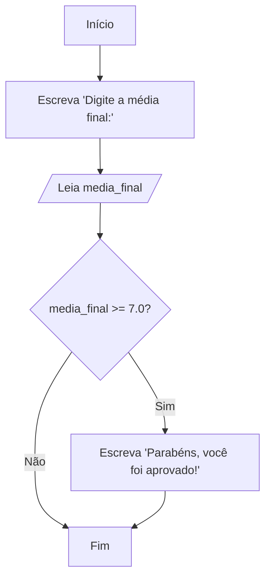
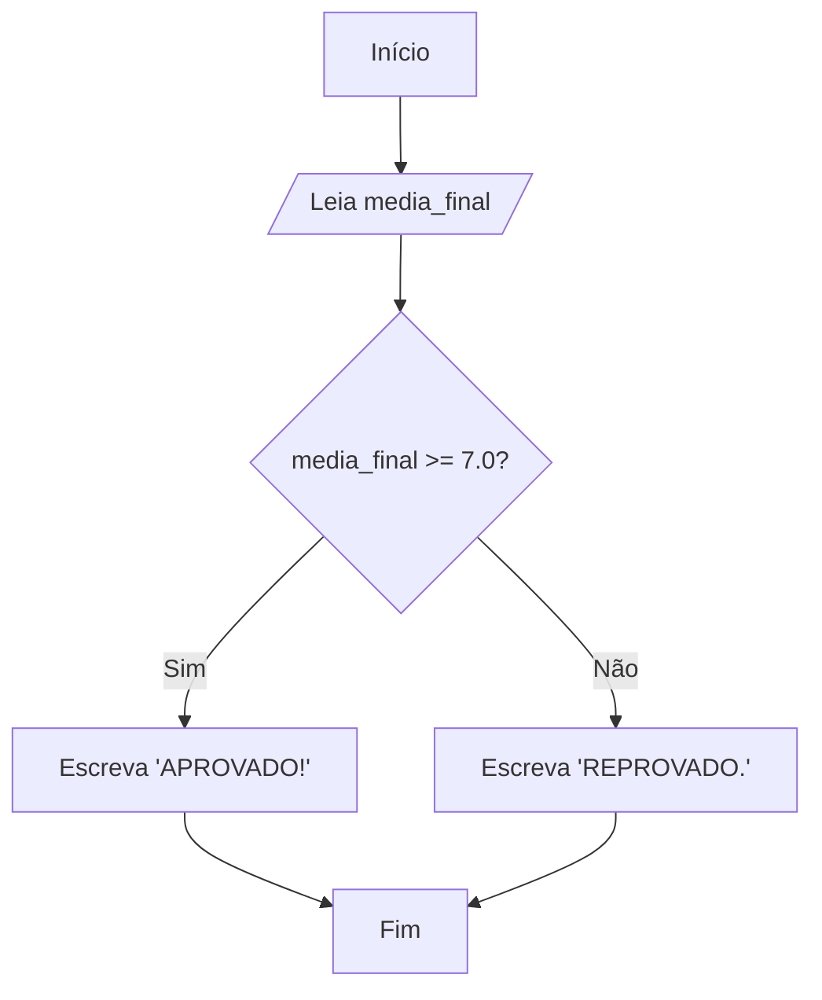
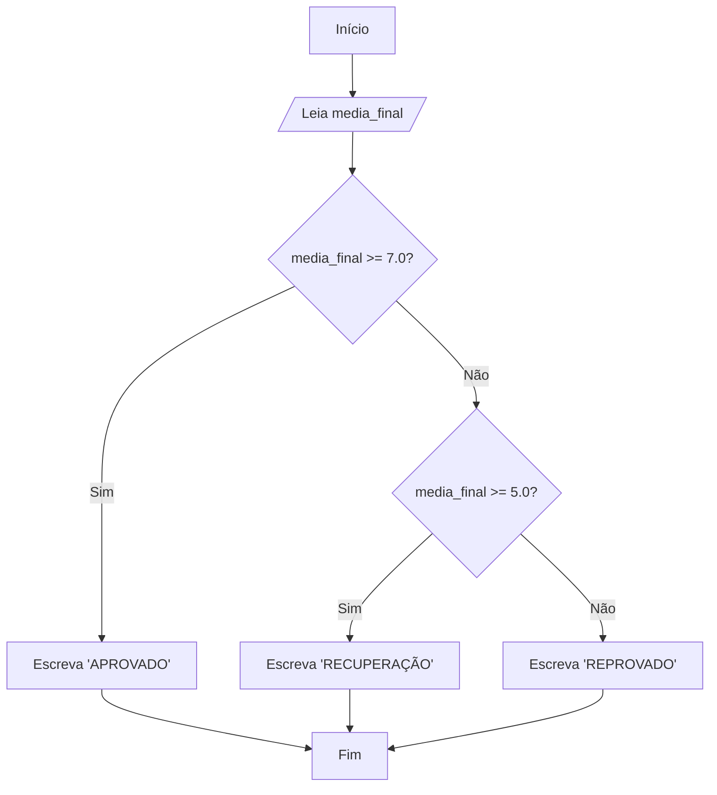
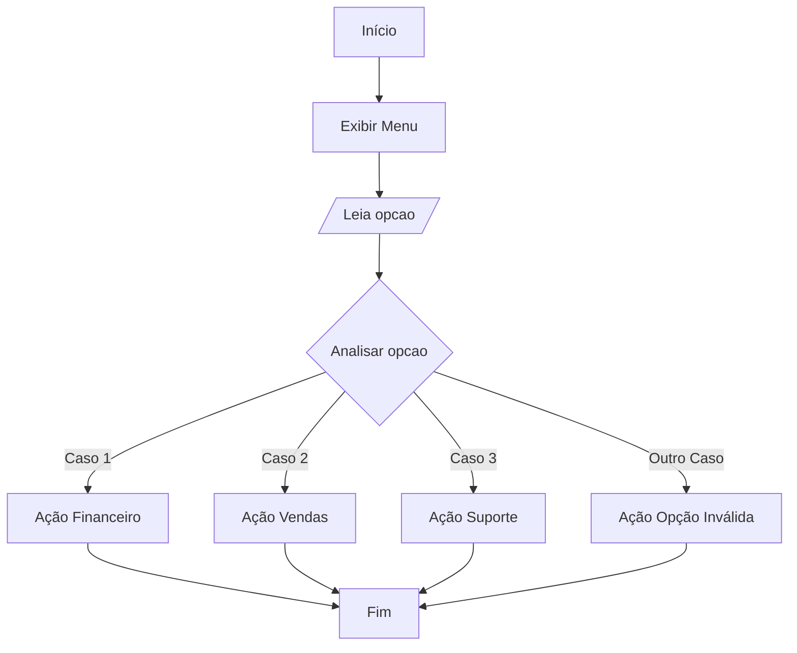

# Módulo 3: Estruturas de Controle Condicionais

### Motivação

Imagine um aplicativo de GPS. Ele não segue um único caminho pré-definido. Ele constantemente toma decisões: _Se_ houver trânsito na avenida principal, _então_ desvie pela rua lateral. _Se_ a rua lateral for de mão única, _então_ calcule uma terceira rota. _Senão_, siga em frente.

Essa capacidade de avaliar condições e alterar o fluxo de execução é o que torna os programas úteis e dinâmicos. As **estruturas condicionais** são as ferramentas que nos permitem implementar essa lógica de tomada de decisão. Elas usam o resultado de uma expressão `LOGICA` (`VERDADEIRO` ou `FALSO`) para decidir qual bloco de código executar.

## 1. Estrutura Se-Então (Condicional Simples)

Esta é a estrutura de decisão mais básica. Ela executa um bloco de código **apenas se** uma determinada condição for `VERDADEIRO`. Se a condição for `FALSO`, nada acontece e o programa segue em frente.

### Motivação

Pense em uma promoção: "Gaste acima de R$100,00 e ganhe um cupom de desconto!". A ação de "ganhar o cupom" só acontece sob uma condição específica. Se você gastar menos, nada de especial acontece.

Vamos criar um algoritmo que verifica se um aluno foi aprovado (média >= 7.0) e, se foi, exibe uma mensagem de parabéns.

### Decomposição

1.  Pedir e ler a média final do aluno.
2.  Verificar se a média é maior ou igual a 7.0.
3.  **Se for**, exibir a mensagem "Parabéns, você foi aprovado!".
4.  Continuar a execução normal do algoritmo.

### Abstração

- Variável para a nota: `media_final` (tipo `REAL`).
- Condição a ser testada: `media_final >= 7.0`.

### Algoritmo - Fluxograma



_Observe como o caminho "Não" simplesmente pula o bloco de ação e vai direto para o ponto de encontro final._

### Algoritmo - Portugol

```portugol
algoritmo "VerificaAprovacaoSimples"
var
   media_final: real
inicio
   escreva("Digite a média final do aluno: ")
   leia(media_final)

   // A estrutura 'se' avalia a condição lógica entre parênteses
   se (media_final >= 7.0) entao
      // Este bloco de código SÓ será executado se a condição for VERDADEIRA.
      escrevaL("Parabéns, você foi aprovado!")
      escrevaL("Boas férias!")
   fimse // 'fimse' delimita o fim do bloco condicional

   escrevaL("Fim da verificação.")
fimalgoritmo
```

_Note que a mensagem "Fim da verificação." será exibida em **todos os casos**._

## 2. Estrutura Se-Então-Senão (Condicional Composta)

Esta estrutura oferece dois caminhos: um para o caso da condição ser `VERDADEIRO` e outro, alternativo, para o caso dela ser `FALSO`.

### Motivação

No nosso exemplo anterior, o aluno que não foi aprovado não recebeu mensagem nenhuma. Seria mais completo informar o status dele também. A lógica é: _Se_ a média for maior ou igual a 7.0, _então_ mostre "Aprovado". _Senão_ (caso contrário), mostre "Reprovado".

### Decomposição

1.  Pedir e ler a média final do aluno.
2.  Verificar se a média é maior ou igual a 7.0.
3.  **Se for**, exibir "Aprovado".
4.  **Senão**, exibir "Reprovado".

### Abstração

- Variável: `media_final` (`REAL`).
- Condição: `media_final >= 7.0`.

### Algoritmo - Fluxograma



_Agora, ambos os caminhos ("Sim" e "Não") possuem um bloco de ação antes de se encontrarem no final._

### Algoritmo - Portugol

```portugol
algoritmo "VerificaAprovacaoCompleta"
var
   media_final: real
inicio
   escreva("Digite a média final do aluno: ")
   leia(media_final)

   se (media_final >= 7.0) entao
      // Bloco executado se a condição for VERDADEIRA
      escreva("Situação: APROVADO!")
   senao
      // Bloco executado se a condição for FALSA
      escreva("Situação: REPROVADO.")
   fimse

fimalgoritmo
```

## 3. Estruturas Condicionais Aninhadas

Ocorre quando precisamos tomar uma decisão _dentro_ de outra decisão. Colocamos uma estrutura `se-senao` dentro do bloco `entao` ou do bloco `senao` de outra estrutura.

### Motivação

A vida raramente tem apenas duas opções. E se, além de "Aprovado" e "Reprovado", houvesse a opção "Recuperação" para médias entre 5.0 e 6.9?

### Decomposição

1.  Pedir e ler a média.
2.  Verificar se a média >= 7.0.
3.  **Se sim**, o aluno está "Aprovado".
4.  **Se não**, precisamos de uma _nova verificação_:
    a. Verificar se a média >= 5.0.
    b. **Se sim**, o aluno está em "Recuperação".
    c. **Se não**, o aluno está "Reprovado".

### Algoritmo - Fluxograma



### Algoritmo - Portugol

```portugol
algoritmo "StatusDoAlunoCompleto"
var
   media_final: real
inicio
   escreva("Digite a média final do aluno: ")
   leia(media_final)

   se (media_final >= 7.0) entao
      escreva("Situação: APROVADO")
   senao // Se não for >= 7, a média é MENOR que 7.
      // Começamos uma nova decisão aqui dentro.
      se (media_final >= 5.0) entao // A média é < 7.0 E >= 5.0?
         escreva("Situação: RECUPERAÇÃO")
      senao // Se não for >= 5.0, a média é MENOR que 5.
         escreva("Situação: REPROVADO")
      fimse // Fim da estrutura interna
   fimse // Fim da estrutura externa

fimalgoritmo
```

**Dica de legibilidade:** A **indentação** (o recuo do código) é fundamental para entender estruturas aninhadas!

## 4. Estrutura Escolha-Caso

É uma alternativa mais limpa e legível para `se` aninhados quando testamos a **mesma variável** contra múltiplos **valores específicos**.

### Motivação

Imagine um menu de atendimento: Digite 1 para "Financeiro", 2 para "Vendas", 3 para "Suporte Técnico". Usar vários `se-senao` aninhados aqui seria confuso. A estrutura `escolha-caso` é perfeita para isso.

### Decomposição

1.  Exibir as opções do menu.
2.  Ler a opção escolhida pelo usuário.
3.  Avaliar a variável `opcao`:
    - **Caso** seja 1, mostrar "Encaminhando para o Financeiro".
    - **Caso** seja 2, mostrar "Encaminhando para Vendas".
    - **Caso** seja 3, mostrar "Encaminhando para o Suporte".
    - Para qualquer **outro caso**, mostrar "Opção Inválida".

### Abstração

- Variável para a escolha do usuário: `opcao` (tipo `INTEIRO`).

### Algoritmo - Fluxograma (Representação simplificada)



### Algoritmo - Portugol

```portugol
algoritmo "MenuDeAtendimento"
var
   opcao: inteiro
inicio
   escrevaL("--- Menu de Atendimento ---")
   escrevaL("1 - Setor Financeiro")
   escrevaL("2 - Setor de Vendas")
   escrevaL("3 - Suporte Técnico")
   escreva("Digite a opção desejada: ")
   leia(opcao)

   escrevaL("") // Pula linha
   escreva("Encaminhando: ")

   escolha opcao // A variável a ser testada
      caso 1
         escreva("Setor Financeiro")
      caso 2
         escreva("Setor de Vendas")
      caso 3
         escreva("Suporte Técnico")
      outrocaso // Se 'opcao' não for 1, 2 ou 3
         escreva("Opção Inválida!")
   fimescolha

fimalgoritmo
```

A estrutura `escolha` é muito mais clara do que `se opcao = 1... senao se opcao = 2...` para este tipo de problema.

## Exercícios Práticos

1.  **Maior de Idade**: Peça ao usuário que digite sua idade e informe se ele é "Maior de idade" ou "Menor de idade" (considere 18 anos como a maioridade). Use uma estrutura `se-senao`.

2.  **Categoria de Nadador**: Peça a idade de um nadador e classifique-o usando `se` aninhados ou operadores lógicos (`E`):

    - 5 a 7 anos: Infantil A
    - 8 a 10 anos: Infantil B
    - 11 a 13 anos: Juvenil A
    - 14 a 17 anos: Juvenil B
    - Acima de 18 anos: Adulto

3.  **Calculadora Simples**: Crie um algoritmo que leia dois números e um operador (`+`, `-`, `*`, `/`). Usando `escolha-caso` para o operador, realize a operação correspondente e exiba o resultado.

## Aplicações Reais

- **Login de Sistemas**: `se (usuario == "admin") E (senha == "1234") entao acesso_liberado... senao acesso_negado`.
- **Filtros de E-commerce**: `se (preco < 100) E (marca == "XPTO") entao mostrar_produto...`
- **Caixas Eletrônicos**: Usam `escolha-caso` para processar a sua opção (Saque, Extrato, Transferência).
- **Jogos**: A inteligência artificial de um inimigo é uma série de condicionais: `se (jogador.vida < 50) entao usar_pocao... senao atacar...`
