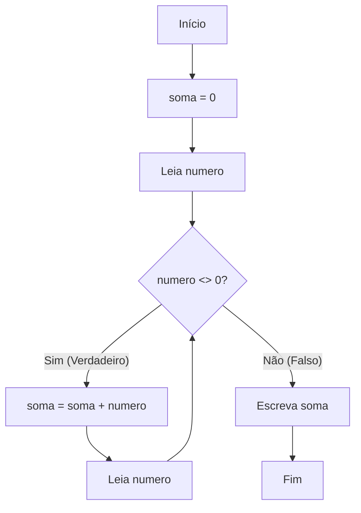
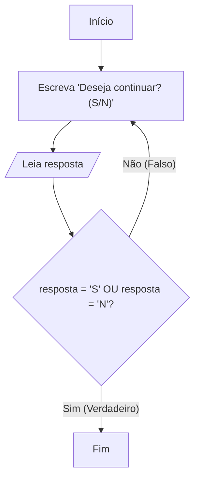

# Módulo 4: Estruturas de Controle de Repetição

### Motivação

Imagine que você precise calcular a soma dos números de 1 a 100. Manualmente, seria uma tarefa tediosa e propensa a erros. Agora, imagine que um programa precise processar os dados de 10.000 clientes. Escrever um código para cada cliente é impossível.

Este é o poder do **Reconhecimento de Padrões** em ação. A tarefa "somar um número" ou "processar um cliente" é um padrão que se repete. As **estruturas de repetição**, também conhecidas como **laços** ou **loops**, nos permitem definir um bloco de código e instruir o computador a executá-lo repetidamente, até que uma certa condição seja satisfeita.

## 1. Conceito de Laços: Contadores e Acumuladores

Antes de vermos as estruturas em si, precisamos de duas ferramentas auxiliares que são quase sempre usadas dentro de loops.

- **Contador**: É uma variável, geralmente do tipo `INTEIRO`, usada para contar quantas vezes o loop foi executado. A cada volta (iteração) do laço, somamos 1 a ela.
  - **Padrão**: `contador <- contador + 1`
- **Acumulador**: É uma variável usada para somar (ou acumular) valores a cada iteração do loop. Ela guarda um total progressivo.
  - **Padrão**: `acumulador <- acumulador + valor_atual`

Ambos precisam ser **inicializados** (geralmente com 0) antes do loop começar!

## 2. Estrutura Enquanto-Faca (Laço com Teste no Início)

Esta é a estrutura de repetição mais flexível. O bloco de código é executado **enquanto** uma condição for `VERDADEIRO`. A condição é testada **antes** de cada iteração.

### Motivação

Use o `enquanto` quando você **não sabe exatamente quantas vezes** o loop precisa ser executado. A execução depende de um evento externo, como a entrada do usuário. Exemplo: "Continue pedindo notas e somando-as, até que o usuário digite -1".

### Decomposição (Exemplo: Soma de vários números)

1.  Inicializar um acumulador `soma` com 0.
2.  Pedir um número ao usuário.
3.  **Enquanto** o número digitado for diferente de 0:
    a. Adicionar o número à `soma`.
    b. Pedir um novo número ao usuário.
4.  Quando o loop terminar, mostrar a `soma` final.

### Algoritmo - Fluxograma



_Observe que o teste `D` ocorre **antes** do corpo do loop `E` e `F`. Se o primeiro número digitado for 0, o loop nunca executa._

### Algoritmo - Portugol

```portugol
algoritmo "SomaComEnquanto"
var
   numero, soma: real
inicio
   soma <- 0 // 1. Inicializa o acumulador

   escreva("Digite um número (ou 0 para parar): ")
   leia(numero) // 2. Leitura inicial, antes do loop

   // 3. O loop começa. Testa a condição ANTES de entrar.
   enquanto (numero <> 0) faca
      // a. Bloco de repetição
      soma <- soma + numero // Acumula o valor

      // b. Atualização da variável de controle do loop
      escreva("Digite outro número (ou 0 para parar): ")
      leia(numero)
   fimenquanto

   // 4. Exibição do resultado final
   escrevaL("")
   escrevaL("A soma total dos números digitados foi: ", soma)
fimalgoritmo
```

**Cuidado! Loop Infinito**: Se a variável da condição (`numero`, no nosso caso) nunca for atualizada dentro do `enquanto`, a condição pode nunca se tornar falsa, e o programa ficará preso executando para sempre.

## 3. Estrutura Repita-Ate (Laço com Teste no Final)

Similar ao `enquanto`, mas com uma diferença crucial: o bloco de código é executado primeiro e a condição é testada **no final**. Isso **garante que o loop seja executado pelo menos uma vez**.

### Motivação

Use o `repita` quando você precisa que uma ação ocorra ao menos uma vez, tipicamente em menus ou validação de entrada. Exemplo: "Peça uma senha. Se estiver errada, repita o pedido". Você sempre pedirá a senha pelo menos uma vez.

### Decomposição (Exemplo: Validação de resposta)

1.  **Repetir** as seguintes ações:
    a. Perguntar ao usuário "Deseja continuar? (S/N)".
    b. Ler a resposta.
2.  Continuar repetindo **até que** a resposta seja "S" ou "N".

### Algoritmo - Fluxograma



_Observe que o teste `D` ocorre **depois** do corpo do loop `B` e `C`. A ação é executada antes da primeira verificação._

### Algoritmo - Portugol

```portugol
algoritmo "ValidaComRepita"
var
   resposta: caractere
inicio
   // A execução entra direto no bloco 'repita'
   repita
      escreva("Deseja executar a operação novamente? [S/N]: ")
      leia(resposta)

      // Converte a resposta para maiúscula para facilitar a comparação
      resposta <- maiusc(resposta)

      se ( (resposta <> "S") e (resposta <> "N") ) entao
         escrevaL("Opção inválida! Digite apenas S ou N.")
      fimse

   // A condição é testada aqui. O loop continua se a condição for FALSA.
   // Ele para quando a condição se torna VERDADEIRA.
   ate (resposta = "S") ou (resposta = "N")

   escrevaL("Obrigado por usar o programa.")
fimalgoritmo
```

## 4. Estrutura Para-Faca (Laço com Variável de Controle)

Esta é a estrutura ideal quando você sabe **exatamente quantas vezes** quer que o loop seja executado. Ela já embute o contador, sua inicialização, a condição de parada e o incremento.

### Motivação

"Mostre a tabuada do 5, de 1 a 10". Sabemos que a repetição ocorrerá exatamente 10 vezes. "Processe os 50 alunos de uma turma". Sabemos que o loop deve rodar 50 vezes.

### Decomposição (Exemplo: Tabuada)

1.  Pedir ao usuário o número para a tabuada.
2.  **Para** um contador `i` indo de 1 **até** 10, **faça**:
    a. Calcular `resultado = numero * i`.
    b. Exibir `numero`, " x ", `i`, " = ", `resultado`.
3.  Fim.

### Algoritmo - Portugol

```portugol
algoritmo "TabuadaComPara"
var
   numero, i: inteiro
inicio
   escreva("Digite um número para ver sua tabuada: ")
   leia(numero)
   escrevaL("--- Tabuada do ", numero, " ---")

   // A estrutura 'para' cuida de tudo:
   // 1. Cria e inicializa o contador 'i' com 1.
   // 2. Repete enquanto 'i' for <= 10.
   // 3. Incrementa 'i' em 1 a cada volta, automaticamente.
   para i de 1 ate 10 faca
      escrevaL(numero, " x ", i, " = ", (numero * i))
   fimpara

   escrevaL("---------------------")
fimalgoritmo
```

O `para` é mais limpo e seguro para loops contados, pois concentra toda a lógica de controle em uma única linha, reduzindo a chance de um loop infinito.

## 5. Análise de Caso: Qual Estrutura Usar?

A escolha da estrutura correta torna seu código mais lógico e legível.

| Pergunta-Chave                                    | Estrutura Recomendada | Exemplo                                                       |
| ------------------------------------------------- | --------------------- | ------------------------------------------------------------- |
| **Sei o número exato de repetições?**             | `PARA`                | Exibir os 12 meses do ano.                                    |
| **O loop pode não executar nenhuma vez?**         | `ENQUANTO`            | Processar itens de um carrinho de compras (pode estar vazio). |
| **O loop precisa executar pelo menos uma vez?**   | `REPITA`              | Pedir uma senha até que o usuário acerte.                     |
| **A repetição depende de uma condição complexa?** | `ENQUANTO`            | Simular um jogo até a vida do jogador chegar a zero.          |

## Exercícios Práticos

1.  **Contagem Regressiva**: Usando a estrutura `PARA`, faça um algoritmo que mostre uma contagem regressiva na tela, começando em 10 e terminando em 0. Mostre uma mensagem "FIM!" após a contagem.

2.  **Adivinhe o Número**: Crie um jogo onde o computador "pensa" em um número (ex: `numero_secreto <- 7`). Peça ao usuário para adivinhar o número. Use `REPITA-ATE` para continuar pedindo um palpite ao usuário **até que** ele acerte. A cada erro, diga se o palpite foi maior ou menor que o número secreto.

3.  **Média da Turma (Refinado)**: Relembre nosso primeiro exemplo. Refaça o algoritmo da média da turma usando a estrutura `ENQUANTO`. O programa deve pedir as notas dos alunos uma a uma e parar quando uma nota negativa for inserida. No final, deve exibir a quantidade de notas lidas e a média da turma. (Atenção: a nota negativa não deve entrar no cálculo!).

## Aplicações Reais

- **Streaming de Vídeo/Música**: Um loop `enquanto (video_nao_acabou)` continua buscando e exibindo os próximos frames ou trechos de áudio.
- **Redes Sociais**: Um loop `para` cada amigo na sua lista, mostra a postagem dele no seu feed.
- **Instalação de Software**: Um loop `repita` a tentativa de conexão com o servidor `ate` conseguir baixar um arquivo de instalação.
- **Processamento de Arquivos**: Um loop `enquanto (nao_chegou_ao_final_do_arquivo)` lê e processa cada linha de um documento de texto ou planilha.
