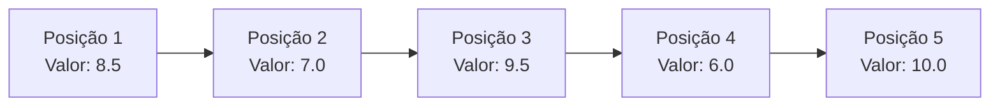
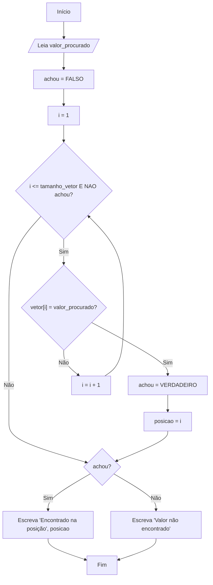

# Módulo 5: Estruturas de Dados Homogêneas I - Vetores

### 1. Introdução: Por que precisamos de vetores?

#### Motivação

Imagine que um professor precisa armazenar a nota final de uma turma de 30 alunos. Usando o que aprendemos até agora, teríamos que criar 30 variáveis diferentes:

`nota_aluno1: real`
`nota_aluno2: real`
`nota_aluno3: real`
...
`nota_aluno30: real`

Isso é extremamente ineficiente, difícil de gerenciar e não escala. E se a turma tivesse 1000 alunos? O Raciocínio Computacional nos diz que deve haver um padrão aqui, uma forma melhor de organizar essa coleção de dados.

A solução é o **Vetor**. Um vetor (ou _array_, em inglês) é uma estrutura de dados que nos permite armazenar múltiplos valores **do mesmo tipo** sob um **único nome**. Pense nele como um gaveteiro: o gaveteiro tem um nome ("Notas da Turma") e cada gaveta é numerada (1, 2, 3, ...), contendo um valor (a nota de um aluno).

## 2. Declaração e Acesso aos Elementos

Um vetor é uma **estrutura de dados homogênea**, o que significa que todos os seus elementos devem ser do mesmo tipo de dado primitivo (`INTEIRO`, `REAL`, `CARACTERE` ou `LOGICO`).

### Declaração em Portugol

Para declarar um vetor, informamos seu nome, o intervalo de seus índices (o número da primeira e da última gaveta) e o tipo de dado que ele vai armazenar.

`nome_do_vetor: vetor [inicio..fim] de TIPO`

**Exemplo Prático:**

```portugol
algoritmo "DeclaracaoDeVetor"
var
   // Declara um vetor chamado 'notas' que pode armazenar 5 notas do tipo REAL.
   // As "gavetas" (índices) são numeradas de 1 a 5.
   notas: vetor[1..5] de real

   // Declara um vetor para guardar o nome de 10 produtos.
   produtos: vetor[1..10] de caractere
inicio
   // O algoritmo pode começar aqui...
fimalgoritmo
```

### Acesso a Elementos: O Papel dos Índices

O **índice** é o número que identifica a posição de cada elemento dentro do vetor. É através do índice que conseguimos ler ou alterar o valor de uma "gaveta" específica.

**Visualizando um vetor `notas` de 5 posições:**



Para acessar o valor `9.5`, que está na terceira posição, usamos `notas[3]`.

```portugol
// Atribuindo um valor à segunda posição do vetor
notas[2] <- 7.0

// Lendo um valor e guardando na terceira posição
escreva("Digite a terceira nota: ")
leia(notas[3])

// Exibindo o valor que está na primeira posição
escreva("A primeira nota foi: ", notas[1])
```

**Importante:** No Portugol (e no VisualG), os índices geralmente começam em **1**. Em muitas linguagens de programação profissionais (Python, Java, C#, JavaScript), os índices começam em **0**. É fundamental ter atenção a este detalhe ao migrar de uma ferramenta para outra!

## 3. Manipulação de Vetores

A verdadeira força dos vetores aparece quando os combinamos com as estruturas de repetição do Módulo 4.

### 3.1 Povoando (Leitura) e Exibindo um Vetor

Usar um laço `PARA` é a maneira mais eficiente de preencher ou mostrar todos os elementos de um vetor.

#### Decomposição

1. Declarar um vetor.
2. Usar um laço `PARA` que vai da primeira à última posição do vetor.
3. Dentro do laço, ler um valor do usuário e armazená-lo na posição `vetor[i]`.
4. Usar um segundo laço `PARA` para exibir cada valor de `vetor[i]`.

#### Algoritmo - Portugol

```portugol
algoritmo "LeituraEscritaVetor"
var
   nomes: vetor[1..4] de caractere
   i: inteiro
inicio
   // --- Leitura (Povoamento) do Vetor ---
   para i de 1 ate 4 faca
      escreva("Digite o ", i, "º nome: ")
      leia(nomes[i])
   fimpara

   escrevaL("") // Pula linha
   escrevaL("--- Nomes Armazenados ---")
   // --- Escrita (Exibição) do Vetor ---
   para i de 1 ate 4 faca
      escrevaL("Posição ", i, ": ", nomes[i])
   fimpara
fimalgoritmo
```

### 3.2 Cálculos com Vetores

Com os dados armazenados, podemos percorrê-los para realizar cálculos como soma, média, ou encontrar o maior e o menor valor.

#### Motivação

Como encontrar a maior nota em uma turma de 30 alunos?

#### Decomposição

1. Preencher o vetor com as notas.
2. Criar uma variável `maior_nota` e inicializá-la com o valor da **primeira** posição do vetor (`notas[1]`).
3. Percorrer o vetor **a partir da segunda posição**.
4. Para cada nota, comparar com `maior_nota`. Se a nota atual for maior, atualizar `maior_nota`.
5. Ao final do laço, `maior_nota` conterá o maior valor do vetor.

#### Algoritmo - Portugol

```portugol
algoritmo "MaiorNotaDaTurma"
var
   notas: vetor[1..5] de real
   maior_nota: real
   i: inteiro
inicio
   // Povoando o vetor de notas
   para i de 1 ate 5 faca
      escreva("Digite a ", i, "ª nota: ")
      leia(notas[i])
   fimpara

   // --- Lógica para encontrar o maior valor ---
   maior_nota <- notas[1] // Assume que a primeira nota é a maior

   // Percorre o vetor a partir da SEGUNDA posição
   para i de 2 ate 5 faca
      se (notas[i] > maior_nota) entao
         // Encontrou uma nota maior, atualiza a variável
         maior_nota <- notas[i]
      fimse
   fimpara

   escrevaL("")
   escrevaL("A maior nota da turma foi: ", maior_nota)
fimalgoritmo
```

### 3.3 Busca de Elementos (Busca Linear)

A busca linear é o algoritmo mais simples para encontrar um valor dentro de um vetor. Ele percorre o vetor posição por posição, comparando cada elemento com o valor procurado.

#### Fluxograma



#### Algoritmo - Portugol

```portugol
algoritmo "BuscaLinear"
var
   numeros: vetor[1..10] de inteiro
   valor_procurado, i, posicao: inteiro
   achou: logico
inicio
   // (Aqui entraria o código para preencher o vetor 'numeros')
   // Para simplificar, vamos preencher manualmente:
   numeros[1] <- 5
   numeros[2] <- 8
   numeros[3] <- 1
   numeros[4] <- 12
   numeros[5] <- 7
   // ... até a posição 10

   escreva("Qual número você deseja encontrar? ")
   leia(valor_procurado)

   achou <- falso
   posicao <- 0
   i <- 1

   enquanto (i <= 10) e (achou = falso) faca
      se numeros[i] = valor_procurado entao
         achou <- verdadeiro
         posicao <- i
      fimse
      i <- i + 1
   fimenquanto

   se (achou) entao // O mesmo que se (achou = verdadeiro)
      escrevaL("O valor ", valor_procurado, " foi encontrado na posição ", posicao)
   senao
      escrevaL("O valor ", valor_procurado, " não está no vetor.")
   fimse
fimalgoritmo
```

### 3.4 Ordenação de Elementos (Bubble Sort)

Ordenar um vetor significa rearranjar seus elementos em uma ordem específica (crescente ou decrescente). O **Bubble Sort** (Método da Bolha) é um algoritmo de ordenação simples, ideal para fins didáticos.

#### Motivação

Como exibir uma lista de pontuações de um jogo, da maior para a menor?

#### Lógica do Bubble Sort

Ele funciona comparando pares de elementos adjacentes e os trocando de lugar se estiverem na ordem errada. Esse processo é repetido várias vezes, fazendo com que os maiores (ou menores) elementos "flutuem" (como bolhas) para o final do vetor a cada passagem.

Precisamos de:

1.  Um laço externo que controla quantas vezes passamos pelo vetor.
2.  Um laço interno que percorre o vetor comparando os pares adjacentes.
3.  Uma variável auxiliar (`aux`) para realizar a troca de valores.

#### Algoritmo - Portugol

```portugol
algoritmo "OrdenacaoBubbleSort"
var
   valores: vetor[1..5] de inteiro
   i, j, aux: inteiro
inicio
   // Preenchendo o vetor
   para i de 1 ate 5 faca
      escreva("Digite o ", i, "º valor: ")
      leia(valores[i])
   fimpara

   // --- Lógica do Bubble Sort ---
   // Laço externo: controla as passagens
   para i de 1 ate 4 faca
      // Laço interno: faz as comparações e trocas
      para j de 1 ate 4 faca
         // Se o elemento atual for maior que o próximo...
         se (valores[j] > valores[j+1]) entao
            // ...troca eles de lugar.
            aux <- valores[j]
            valores[j] <- valores[j+1]
            valores[j+1] <- aux
         fimse
      fimpara
   fimpara

   escrevaL("")
   escrevaL("--- Vetor Ordenado ---")
   para i de 1 ate 5 faca
      escreva(valores[i], " ")
   fimpara
fimalgoritmo
```

## 4. Exercícios Práticos

1.  **Vetor Invertido**: Crie um algoritmo que leia 6 números inteiros para um vetor. Em seguida, o algoritmo deve exibir os números na ordem inversa em que foram digitados.
2.  **Nomes e Notas**: Crie dois vetores de 5 posições, um para nomes (`CARACTERE`) e outro para notas (`REAL`). Peça para o usuário digitar o nome e a nota de 5 alunos. No final, encontre e exiba o nome do aluno que tirou a maior nota.
3.  **Desafio - Contagem de Pares**: Leia 10 números inteiros para um vetor e, ao final, exiba a quantidade de números pares que foram digitados.

## 5. Aplicações Reais

- **Contatos do Celular**: Uma lista de contatos é um vetor (ou uma estrutura mais complexa) onde cada posição armazena as informações de uma pessoa.
- **Playlist de Músicas**: Cada música em uma playlist é um elemento de um vetor. A função "shuffle" (aleatório) é um algoritmo que reordena esse vetor.
- **Carrinho de Compras**: Os itens que você adiciona em um site de e-commerce são armazenados em um vetor. A soma total é calculada percorrendo esse vetor.
- **Histórico do Navegador**: Cada site visitado é adicionado a uma estrutura que se comporta como um vetor.
