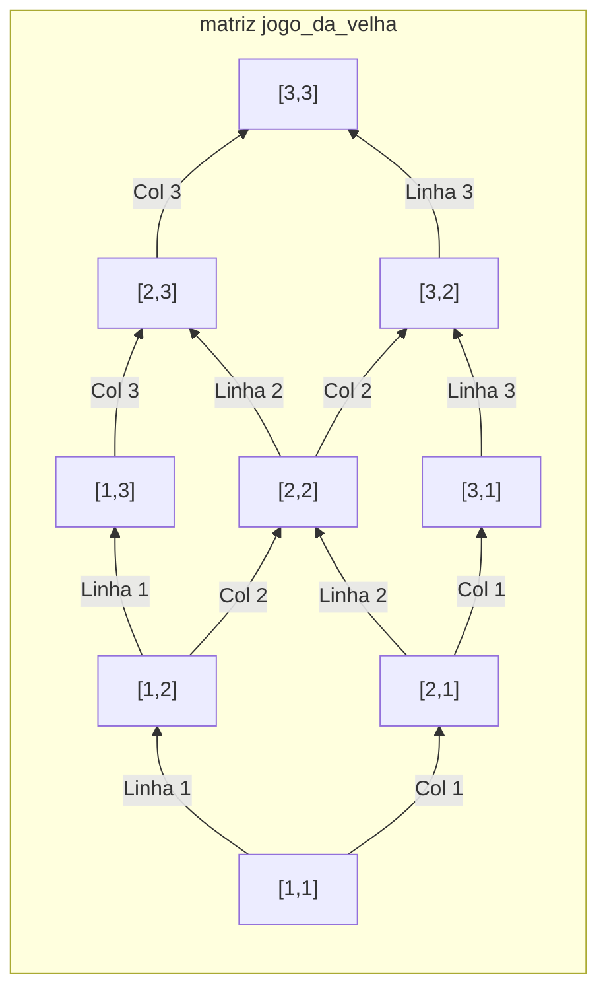

# Módulo 6: Estruturas de Dados Homogêneas II - Matrizes

### 1. Conceito de Matrizes (Arrays Bidimensionais)

#### Motivação

No módulo anterior, usamos um vetor para armazenar as notas de uma turma. Mas e se quiséssemos armazenar 4 notas para cada um dos 30 alunos? Ou se quiséssemos criar um jogo de Batalha Naval ou Jogo da Velha? Um vetor, que é uma linha única de "gavetas", não é suficiente.

Precisamos de uma estrutura que tenha **linhas e colunas**. Uma **matriz** (ou array bidimensional) é exatamente isso: uma estrutura de dados homogênea organizada como uma tabela. Pense em uma planilha, um tabuleiro de xadrez ou um mapa de assentos de cinema. Todos são exemplos de matrizes.

## 2. Declaração e Acesso a Elementos

Uma matriz é declarada de forma similar a um vetor, mas especificando as dimensões de linhas e colunas.

### Declaração em Portugol

`nome_da_matriz: vetor [linha_inicio..linha_fim, col_inicio..col_fim] de TIPO`

**Exemplo Prático:**

```portugol
algoritmo "DeclaracaoDeMatriz"
var
   // Declara uma matriz 3x4 (3 linhas, 4 colunas) para guardar notas de alunos.
   // Linhas de 1 a 3, colunas de 1 a 4.
   boletim: vetor[1..3, 1..4] de real

   // Declara uma matriz 3x3 para um jogo da velha.
   jogo_da_velha: vetor[1..3, 1..3] de caractere
inicio
   // ...
fimalgoritmo
```

### Acesso a Elementos (Linha, Coluna)

Para acessar um elemento em uma matriz, precisamos de **dois índices**: um para a **linha** e outro para a **coluna**. A convenção é sempre `matriz[linha, coluna]`.

**Motivação:** Pense no jogo **Batalha Naval**. Você não diz apenas "5", você diz "C-5", especificando uma coluna (C) e uma linha (5). O acesso a uma matriz funciona da mesma forma.

**Visualizando uma matriz `jogo_da_velha` 3x3:**



```portugol
// Atribuindo o caractere 'X' ao centro do tabuleiro
jogo_da_velha[2, 2] <- "X"

// Lendo um valor para a primeira posição
escreva("Digite o valor para a posição [1, 1]: ")
leia(jogo_da_velha[1, 1])

// Exibindo o valor da última posição
escreva("O canto inferior direito é: ", jogo_da_velha[3, 3])
```

## 3. Manipulação de Matrizes

A combinação de matrizes com **laços aninhados** (um `para` dentro de outro `para`) é a chave para percorrê-las e manipulá-las eficientemente.

### 3.1 Povoamento e Exibição com Laços Aninhados

#### Decomposição

1.  Declarar uma matriz.
2.  Criar um laço **externo** para percorrer as **linhas** (com um contador `i`).
3.  Dentro dele, criar um laço **interno** para percorrer as **colunas** (com um contador `j`).
4.  Dentro do laço interno, ler ou escrever o elemento `matriz[i, j]`.

#### Algoritmo - Portugol

```portugol
algoritmo "PovoarExibirMatriz"
var
   numeros: vetor[1..2, 1..3] de inteiro // Matriz 2x3
   i, j: inteiro // i para linhas, j para colunas
inicio
   // --- Leitura (Povoamento) da Matriz ---
   // O laço externo controla as LINHAS
   para i de 1 ate 2 faca
      // O laço interno controla as COLUNAS de cada linha
      para j de 1 ate 3 faca
         escreva("Digite o valor para a posição [", i, ",", j, "]: ")
         leia(numeros[i, j])
      fimpara
   fimpara

   escrevaL("")
   escrevaL("--- Matriz Digitada ---")
   // --- Escrita (Exibição) da Matriz ---
   para i de 1 ate 2 faca
      // Para cada linha, percorremos todas as suas colunas
      para j de 1 ate 3 faca
         // Usamos 'escreva' para manter os valores na mesma linha
         escreva(numeros[i, j], "   ")
      fimpara
      // Pulamos a linha ao final de cada linha da matriz
      escrevaL("")
   fimpara
fimalgoritmo
```

### 3.2 Percorrendo Linhas, Colunas e Diagonais

Podemos usar os laços para focar em partes específicas da matriz.

**Soma de todos os elementos:** Basta usar um acumulador dentro dos laços aninhados.
`soma <- soma + numeros[i, j]`

**Soma dos elementos de uma linha específica (ex: linha 2):** Fixamos a linha e percorremos as colunas.

```portugol
soma_linha2 <- 0
para j de 1 ate 3 faca
   soma_linha2 <- soma_linha2 + numeros[2, j]
fimpara
```

**Soma dos elementos da Diagonal Principal:** Em uma matriz quadrada, a diagonal principal é onde `linha = coluna` (ex: [1,1], [2,2], [3,3]).

```portugol
algoritmo "SomaDiagonalPrincipal"
var
   mat: vetor[1..3, 1..3] de inteiro
   i, soma: inteiro
inicio
   // (Aqui entraria o código para preencher a matriz 'mat')
   soma <- 0
   para i de 1 ate 3 faca
      // Acessamos apenas os elementos onde i = j
      soma <- soma + mat[i, i]
   fimpara
   escrevaL("A soma da diagonal principal é: ", soma)
fimalgoritmo
```

**Soma dos elementos da Diagonal Secundária:** A diagonal secundária é onde `linha + coluna = N + 1` (sendo N a dimensão da matriz). Para uma matriz 3x3, são os elementos onde `i + j = 4` (ex: [1,3], [2,2], [3,1]).

### 3.3 Busca de um Elemento na Matriz

Similar à busca em vetores, mas usando laços aninhados.

```portugol
algoritmo "BuscaEmMatriz"
var
   mat: vetor[1..3, 1..3] de inteiro
   valor_procurado, i, j, linha_encontrada, col_encontrada: inteiro
   achou: logico
inicio
   // (Preencher a matriz 'mat' aqui)

   escreva("Qual valor você deseja procurar? ")
   leia(valor_procurado)

   achou <- falso
   i <- 1
   // Usamos um 'enquanto' para poder parar a busca assim que encontrar
   enquanto (i <= 3) e (nao achou) faca
      j <- 1
      enquanto (j <= 3) e (nao achou) faca
         se mat[i, j] = valor_procurado entao
            achou <- verdadeiro
            linha_encontrada <- i
            col_encontrada <- j
         fimse
         j <- j + 1
      fimenquanto
      i <- i + 1
   fimenquanto

   se (achou) entao
      escrevaL("Valor encontrado na linha ", linha_encontrada, " e coluna ", col_encontrada)
   senao
      escrevaL("Valor não encontrado na matriz.")
   fimse
fimalgoritmo
```

## 4. Exercícios Práticos

1.  **Boletim da Turma**: Crie uma matriz 4x3 para armazenar as 3 notas de 4 alunos.
    a. Peça para o usuário digitar todas as notas.
    b. Calcule e exiba a média de cada aluno (a média de cada linha).
    c. Calcule e exiba a média de cada prova (a média de cada coluna).

2.  **Matriz Identidade**: Uma matriz identidade é uma matriz quadrada onde todos os elementos da diagonal principal são 1 e os demais são 0. Crie um algoritmo que preencha uma matriz 5x5 para ser uma matriz identidade e, em seguida, a exiba na tela.

3.  **Desafio - Jogo da Velha (Estrutura)**: Crie o tabuleiro de um jogo da velha usando uma matriz 3x3 de caracteres.
    a. Inicialize todas as posições com um espaço em branco " ".
    b. Crie um laço que se repete 9 vezes. A cada vez, ele deve perguntar a um jogador (alternando entre 'X' e 'O') a linha e a coluna onde ele quer jogar.
    c. Após cada jogada, exiba o tabuleiro atualizado.
    _(A verificação de quem venceu é um desafio extra!)_

## 5. Aplicações Reais

- **Processamento de Imagens**: Uma imagem digital é uma matriz de pixels. Cada elemento da matriz armazena a cor de um ponto da imagem. Filtros como "preto e branco" ou "desfoque" são algoritmos que percorrem essa matriz.
- **Planilhas Eletrônicas**: Programas como Excel ou Google Sheets são, em sua essência, uma grande matriz onde cada célula pode ser acessada por sua linha e coluna.
- **Mapas e Grafos**: Mapas de jogos, redes de cidades ou conexões em redes sociais podem ser representados por matrizes (matrizes de adjacência) que indicam como os pontos se conectam.
- **Computação Gráfica 3D**: Transformações em objetos 3D (rotação, escala, translação) são feitas através de cálculos complexos envolvendo matrizes.
